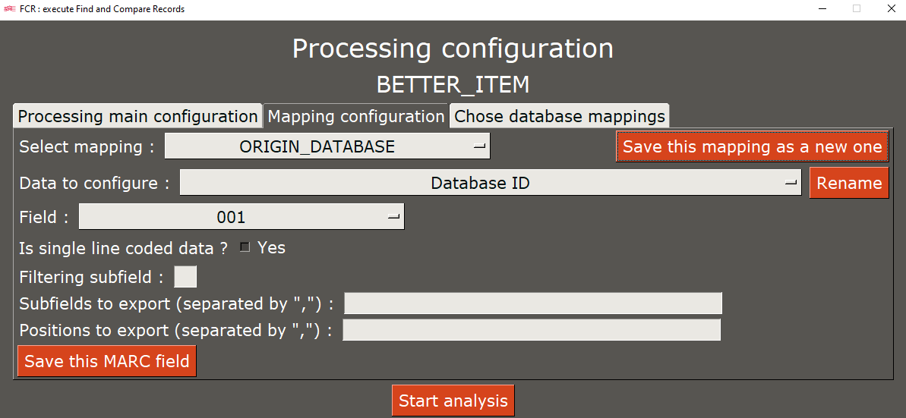
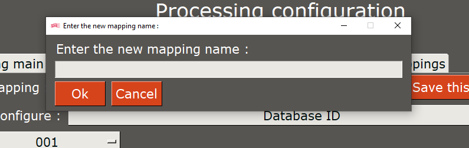
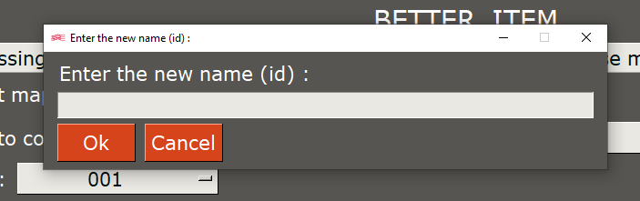
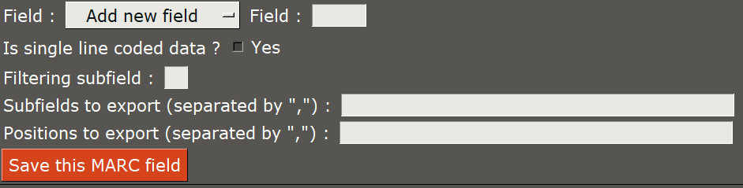
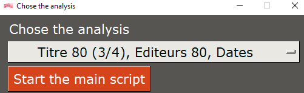

# How to use _Find and Compare Records_

Once the application downloaded et the `sample.env` file renammed to `.env`, you can execute the application.

To do it :

* Execute the file `FCR.bat` found at the root of the application
* Or, using the command terminal, go to the application folder (using `cd`) and execute with Python the file `main_gui.py`

## Step 1 : main configuration

_The top-right button allows to switch language between french and english._

This screen is used to configure the main settings of the application :

* The processing to use _([see more about available processings](./processings.md))_
* Files path :
  * To the input file _([see more about the input file](./input_file.md))_
  * To the output folder
  * To the folder containing the log file
* The service name (only used for logs, notable namming the file)
* The log level

The _Save these executon settigs_ button can be used to save the settings currently displayed for a future execution (including language).

Once this screen correctly configured (and possibly saved), the _Next (processing configuration)_ button is used to go to nest step.

## Step 2 : processing configuration

This new screen has 3 tabs :

* _Processing main configuration_
* _Mapping configuration_
* _Chose database mappings_

A text under the screen title reminds which processing will be used.

Once every tab is correctly configured, the _Start analysis_ button is used to go to the third and last step.

### _Processing main configuration_ tab

This tab displayes settings is based on the chosen processing.

The _Save main processing configuration settings_ button is used to saved currently displayed settings for a fututre execution.

#### `BETTER_ITEM` suite

* Origin database URL : this processing retrieve data from the origin database through its APIs, the URL should be the __domain name for API exution__
* ILN : library ILN _(used to filter identifiers in other databases)_
* RCR : library RCR _(used to filter items & items barcodes)_

#### `MARC_FILE_IN_KOHA_SRU`

* Target database URL : this processing retrieve data from the origin database through its APIs, the URL should be the __domain name for API exution__ (or the SRU if it is used)
* Filter 1, 2 & 3 : free filters, configurable based on target database (or origin)
  * Filter 1 is used to filter items & items barcodes
  * To link filters to data, the code in `cl_PODA.py` needs to be edited ([see developper documentation about PODAs on that subject](../../PODAs.md#database))

### _Mapping configuration_ tab

Cet onglet est le plus complexe mais également celui qui, une fois sauvegardée, n'a plus besoin d'être reconfiguré.

Il permet de configurer via une interface quelles données seront récupérées dans les notices bibliographiques (configurées dans le fichier `json_configs/marc_fields.json`).
Pour plus d'informations sur comment configurer ces mappings, se référer à [la documentation sur l'extracteur de données universel](../../../doc/UDE.md).

Dans un premier temps, il est nécessaire de sélectionner le mapping que l'on souhaite modifier.
Il est possible de créer un nouveau mapping à l'aide du bouton _Sauvegarder ce mapping comme un nouveau_, qui copiera l'ensemble des données actuellement configurées pour le mapping actuellement sélectionné vers le nouveau.
Le bouton ouvrira une boîte de dialogue vous demandant de renseigner le nom du nouveau mapping, il faudra ensuite valider avec `Ok` pour procéder à la sauvegarde.

Dans un second temps, il est nécessaire de choisir la donnée à configurer.
Il est possible de renommer cette donnée pour la langue actuelle avec le bouton _Renommer_.
Le bouton ouvrira une boîte de dialogue vous demandant de renseigner le nouveau nom de la donnée, il faudra ensuite valider avec `Ok` pour procéder à la sauvegarde.
Pour s'assurer de la donnée qui est en cours d'édition, entre parenthèses se trouve l'identifiant de la donnée.

Dans un troisième temps, il est nécessaire de choisir le champ UNIMARC à configurer.
Pour chaque champ, quatre données sont à remplir (ou non) :

* Est une donnée codée en une ligne : permet de déterminer si le champ est une donnée codée présente dans un seul sous-champ (exemple `100`)
* Sous-champ filtre : permet de renseigner le sous-champ qui doit permettre d'exclure les champs non voulus (exemple : uniquement traiter les exemplaires de la bibliothèque renseignée)
* Sous-champs à exporter : la liste des sous-champs à exporter, qui doivent être séparés par des virgules (les espaces entre les virgules ne sont pas pris en compte)
* Positions à exporter :
  * La liste des positions à exporter, qui doivent être séparées par des virgules (les espaces entre les virgules ne sont pas pris en compte)
  * Cette information n'est utile que si le champ est déterminé comme étant une donnée codée en une seule ligne
  * Pour extraire un caractère uniquement, renseigner sa position
  * Pour extraire une chaîne de caractères, renseigner la première position à exporter et la dernière position à exporter, séparées par un tiret

Pour ajouter des nouveaux champs, sélectionner le champ `Ajouter un nouveau champ`, qui fera apparaître une nouvelle donnée à remplir à côté de lui.
Renseignez dedans le numéro du champ voulu.

Pour sauvegarder la modification effectuée sur le champ, cliquez sur le bouton _Sauvegarder ce champ MARC_.
Cette opération est nécessaire __pour chaque champ__, sinon les données ne seront pas sauvegardées.

### _Chose database mappings_ tab

This tab is the easiest as it only requires to chose the mapping we want to use for the origin database & for the target database.

The _Save chosen database mappings_ button is used to save currently displayed settings for future execution.

## Step 3 : chosing the analysis

This last screen is used to chose the analysis we want to execute, from the ones defined in the `json_configs/analysis.json` file.

The _Start main script_ button is used to start the script.