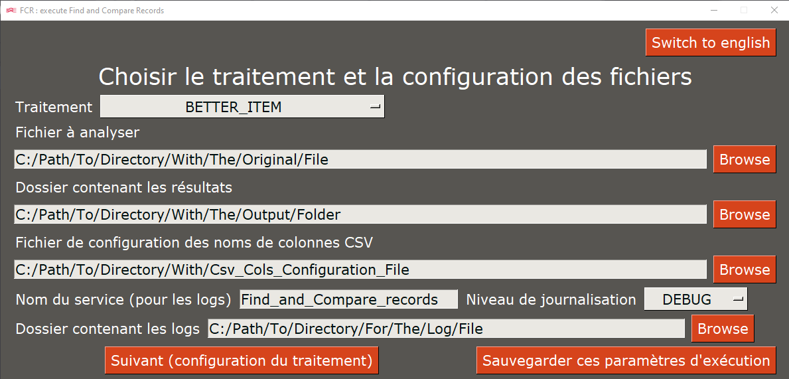
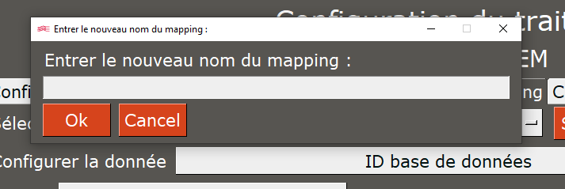
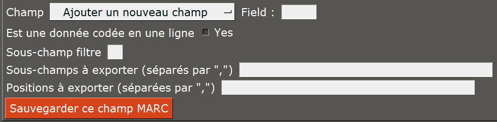

# Comment utiliser _Find and Compare Records_

Une fois l'application téléchargée et le fichier `sample.env` renommé en `.env`, vous pouvez exécuter l'application.

Pour ce faire :

* Exécuter le fichier `FCR.bat` situé à la racine de l'application
* Ou, avec l'invite de commande, placez-vous dans le répertoire de l'application (avec `cd`) et exécuter avec Python le fichier `main_gui.py`

## Étape 1 : configuration principale

_Le bouton en haut à droite permet de changer la langue de l'interface du entre le français et l'anglais._

Cet écran permet de configurer les paramètres généraux de l'application à savoir :

* Le traitement qui sera exécuté _(au 22/11/2023, seul `BETTER_ITEM` est supporté)_ _([voir plus d'informations sur les traitements disponibles](./processings.md))_
* Les chemins d'accès :
  * Au fichier à analyser _([voir plus d'informations sur ce fichier](./input_file.md))_
  * Au dossier qui contiendra les fichiers de résultats
  * Au dossier qui contiendra le fichier des journaux
* Le nom du service (qui sert uniquement pour les journaux, notamment pour nommer le fichier)

Le bouton _Sauvegarder ces paramètres d'exécution_ permet de sauvegarder les paramètres actuellement définis sur l'interface pour une prochaine exécution (langue comprise).

Une fois cet écran correctement paramétré (voire sauvegarder), le bouton _Suivant (configuration du traitement)_ permet de passer à la seconde étape.

## Étape 2 : configuration du traitement

Ce nouvel écran contient 3 onglets :

* _Configuration principale du traitement_
* _Configuration des mappings_
* _Choix des mappings de BDD_

Une fois la configuration de tous les onglets terminée, le bouton _Lancer l'analyse_ permet de passer à la troisième et dernière étape.

### Onglet _Configuration principale du traitement_

Cet onglet n'affiche pas les mêmes options selon le traitement choisi :

* __`BETTER_ITEM`__ :
  * URL de la base de données d'origine : ce traitement récupère les données de la base de données d'origine via les APIs de celle-ci, il faut donc indiquer __le nom de domaine qui permet d'exécuter les APIs__ (seul Koha est supporté pour le moment)
  * ILN : l'ILN de l'établissement concerné
  * RCR : le RCR de la bibliothèque concernée
* __`OTHER_DB_IN_LOCAL_DB`__ :
  * _Traitement non configuré pour le moment_

Le bouton _Sauvegarder les paramètres principaux de ce traitement_ permet de sauvegarder les paramètres actuellement définis sur l'interface pour une prochaine exécution.

### Onglet _Configuration des mappings_

Cet onglet est le plus complexe mais également celui qui, une fois sauvegardée, n'a plus besoin d'être reconfiguré.

Il permet de configurer via une interface quelles données seront récupérées dans les notices bibliographiques (configurées dans le fichier `json_configs/marc_fields.json`).
Pour plus d'informations sur comment configurer ces mappings, se référer à [la documentation sur l'extracteur de données universel](../../../doc/UDE.md).

Dans un premier temps, il est nécessaire de sélectionner le mapping que l'on souhaite modifier.
Il est possible de créer un nouveau mapping à l'aide du bouton _Sauvegarder ce mapping comme un nouveau_, qui copiera l'ensemble des données actuellement configurées pour le mapping actuellement sélectionné vers le nouveau.
Le bouton ouvrira une boîte de dialogue vous demandant de renseigner le nom du nouveau mapping, il faudra ensuite valider avec `Ok` pour procéder à la sauvegarde.

Dans un second temps, il est nécessaire de choisir la donnée à configurer.
Il est possible de renommer cette donnée pour la langue actuelle avec le bouton _Renommer_.
Le bouton ouvrira une boîte de dialogue vous demandant de renseigner le nouveau nom de la donnée, il faudra ensuite valider avec `Ok` pour procéder à la sauvegarde.
Pour s'assurer de la donnée qui est en cours d'édition, entre parenthèses se trouve l'identifiant de la donnée.

Dans un troisième temps, il est nécessaire de choisir le champ UNIMARC à configurer.
Pour chaque champ, quatre données sont à remplir (ou non) :

* Est une donnée codée en une ligne : permet de déterminer si le champ est une donnée codée présente dans un seul sous-champ (exemple `100`)
* Sous-champ filtre : permet de renseigner le sous-champ qui doit permettre d'exclure les champs non voulus (exemple : uniquement traiter les exemplaires de la bibliothèque renseignée)
* Sous-champs à exporter : la liste des sous-champs à exporter, qui doivent être séparés par des virgules (les espaces entre les virgules ne sont pas pris en compte)
* Positions à exporter :
  * La liste des positions à exporter, qui doivent être séparées par des virgules (les espaces entre les virgules ne sont pas pris en compte)
  * Cette information n'est utile que si le champ est déterminé comme étant une donnée codée en une seule ligne
  * Pour extraire un caractère uniquement, renseigner sa position
  * Pour extraire une chaîne de caractères, renseigner la première position à exporter et la dernière position à exporter, séparées par un tiret

Pour ajouter des nouveaux champs, sélectionner le champ `Ajouter un nouveau champ`, qui fera apparaître une nouvelle donnée à remplir à côté de lui.
Renseignez dedans le numéro du champ voulu.

Pour sauvegarder la modification effectuée sur le champ, cliquez sur le bouton _Sauvegarder ce champ MARC_.
Cette opération est nécessaire __pour chaque champ__, sinon les données ne seront pas sauvegardées.

### Onglet _Choix des mappings de BDD_

Cet onglet est le plus simple puisqu'il suffit de choisir le mapping que l'on souhaite attribuer à la base de donnée d'origine et à la base de donnée de destination.

Le bouton _Sauvegarder les mappings de BDD choisis_ permet de sauvegarder les paramètres actuellement définis sur l'interface pour une prochaine exécution.

## Étape 3 : choisir l'analyse

Cette dernière fenêtre permet de choisir l'analyse voulue parmis celles définies dans le fichier `json_configs/analysis.json`.

Le buton _Lancer le script principal_ permet (enfin) de lancer le script.